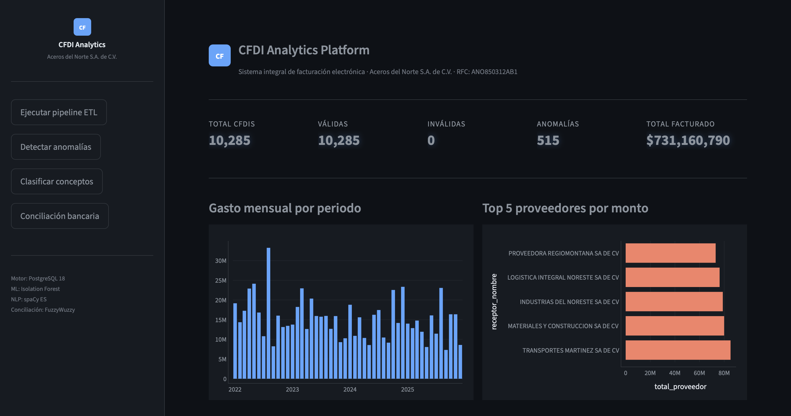
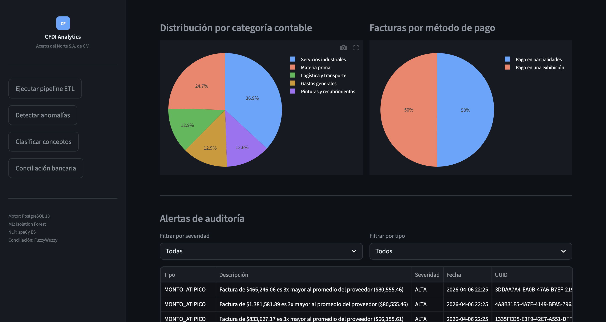
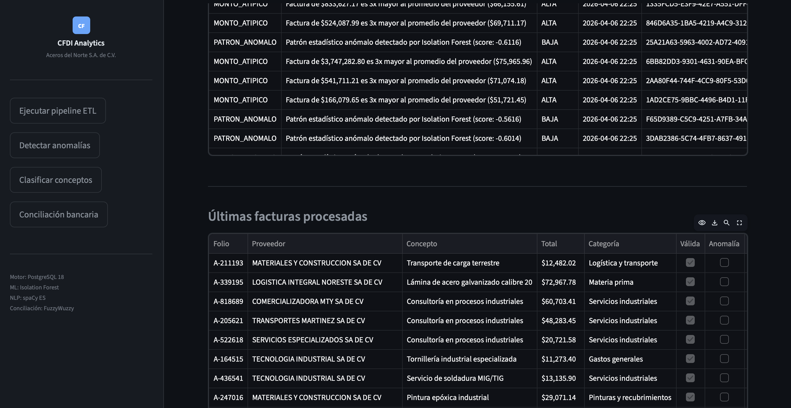

# CFDI Analytics Platform




> Sistema integral de análisis de Comprobantes Fiscales Digitales por Internet (CFDI 4.0) — Facturación electrónica mexicana con Machine Learning, NLP y API REST.

**Empresa simulada:** Aceros del Norte S.A. de C.V. · RFC: ANO850312AB1 · Monterrey, Nuevo León

---

## ¿Qué es este proyecto?

Plataforma empresarial end-to-end que automatiza el ciclo completo de facturación electrónica mexicana. Procesa archivos XML en formato CFDI 4.0 del SAT, los valida contra reglas fiscales reales, detecta anomalías con Machine Learning, clasifica conceptos con NLP, concilia pagos contra estados de cuenta bancarios y presenta todo en un dashboard ejecutivo interactivo.

---

## Módulos del sistema

| Módulo | Archivo | Descripción |
|--------|---------|-------------|
| Generador | `src/generator.py` | Genera CFDIs sintéticos en formato XML 4.0 real del SAT |
| Parser | `src/parser.py` | Lee XMLs y extrae todos los campos del CFDI |
| Validador fiscal | `src/validator.py` | 9 reglas del SAT: RFC, fechas, montos, UUID, régimen |
| Pipeline ETL | `src/etl.py` | Orquesta parser, validador y carga a PostgreSQL |
| Detección ML | `src/anomaly.py` | Isolation Forest detecta facturas anómalas |
| Clasificador NLP | `src/classifier.py` | spaCy categoriza conceptos en categorías contables |
| Conciliación | `src/conciliacion.py` | Matching fuzzy contra estado de cuenta bancario |
| Dashboard | `app.py` | Dashboard ejecutivo con Streamlit y Plotly |
| API REST | `api.py` | FastAPI con endpoints para integración con ERP |

---

## Arquitectura del pipeline

XMLs CFDI 4.0

↓

Parser (lxml) — extrae 20+ campos por factura

↓

Validador fiscal — 9 reglas del SAT 2024

↓

Pipeline ETL — PostgreSQL 18 local

↓

Isolation Forest — detección de anomalías
spaCy ES        — clasificación de conceptos
FuzzyWuzzy      — conciliación bancaria

↓
Dashboard Streamlit + Plotly
API REST FastAPI — integración con ERP/SAP
---

## Tecnologías

**Backend y datos**
- Python 3.14
- PostgreSQL 18
- SQLAlchemy
- lxml
- Pandas

**Machine Learning y NLP**
- scikit-learn — Isolation Forest
- spaCy ES — clasificación en español
- FuzzyWuzzy — matching aproximado

**Visualización y API**
- Streamlit + Plotly
- FastAPI + Uvicorn

---

## Cómo correrlo localmente
```bash
git clone https://github.com/AlejandroBasualdo/CFDI-Analytics-Platform.git
cd CFDI-Analytics-Platform

python3 -m venv venv --without-pip
source venv/bin/activate
curl https://bootstrap.pypa.io/get-pip.py -o get-pip.py
python3 get-pip.py

pip install -r requirements.txt
python3 -m spacy download es_core_news_sm

psql -U postgres -c "CREATE DATABASE cfdi_analytics;"

cp .env.example .env

python3 -m src.generator
python3 -m src.etl
python3 -m src.anomaly
python3 -m src.classifier
python3 -m src.conciliacion

streamlit run app.py
uvicorn api:app --reload
```

---

## Endpoints de la API REST

| Método | Endpoint | Descripción |
|--------|----------|-------------|
| GET | `/` | Estado de la API |
| GET | `/facturas` | Lista de facturas con filtros |
| GET | `/facturas/{uuid}` | Detalle de una factura por UUID |
| GET | `/anomalias` | Facturas marcadas como anómalas |
| GET | `/alertas` | Alertas de auditoría generadas |
| GET | `/stats` | KPIs ejecutivos del sistema |
| POST | `/facturas/webhook` | Recibe nuevas facturas en tiempo real |

Documentación automática en `http://localhost:8000/docs`

---

## Decisiones técnicas

**Isolation Forest** — algoritmo estándar para detección de anomalías sin supervisión. No requiere facturas etiquetadas como fraude para entrenarse. Aprende el comportamiento normal y marca lo que se desvía estadísticamente.

**FuzzyWuzzy** — los bancos abrevian los nombres de proveedores de formas impredecibles. El matching exacto falla casi siempre. FuzzyWuzzy calcula similitud aproximada entre strings, permitiendo conciliar nombres abreviados con un alto porcentaje de confianza.

**PostgreSQL local** — elimina latencia de red, no tiene límites de storage en tier gratuito y permite queries complejas sobre miles de facturas de forma instantánea.

**Validación matemática del RFC** — el RFC tiene un dígito verificador calculado con un algoritmo específico del SAT. Validarlo matemáticamente detecta RFCs inventados que tienen formato correcto pero no existen en el padrón fiscal, uno de los indicadores más comunes de factura fantasma.

---

## Autor

Alejandro Basualdo — ITS FIME UANL
Ingeniería en Tecnologías de Software
